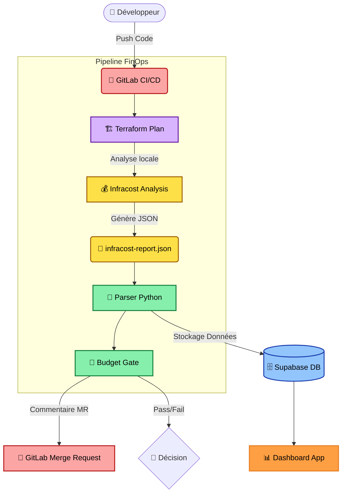
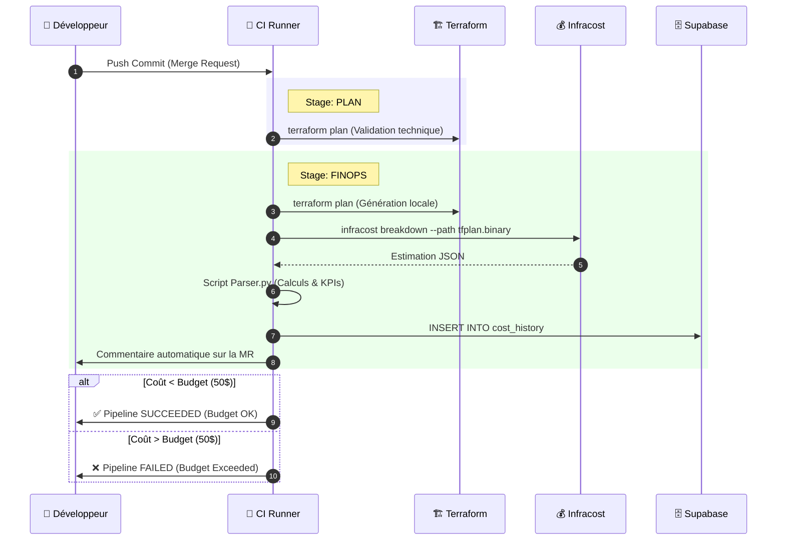
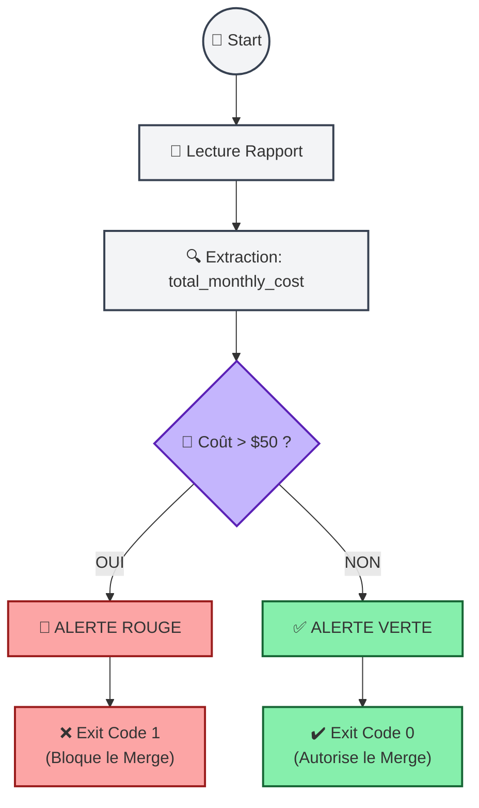

# 🌿 EcoArch: Plateforme de Gouvernance FinOps Automatisée

> **Shift-Left FinOps** : Estimez, contrôlez et optimisez les coûts Cloud avant même le déploiement.
Ce projet implémente un pipeline CI/CD intelligent sur GitLab qui calcule le coût de l'infrastructure Google Cloud (Terraform) lors de chaque Merge Request. Il bloque automatiquement les changements qui dépassent le budget défini, commente les analyses de coûts sur les MR, et alimente un Dashboard de suivi financier via Supabase.

---

## 📑 Sommaire Interactif

1. [🏗️ Architecture du Système](#architecture-du-système)
2. [🔄 Workflow FinOps (CI/CD)](#workflow-finops-cicd)
3. [🧠 Logique de la Budget Gate](#logique-de-la-budget-gate)
4. [📂 Structure du Projet](#structure-du-projet)
5. [🛠️ Stack Technique](#stack-technique)
6. [🚀 Installation & Configuration](#installation--configuration)
7. [📊 Base de Données & KPIs](#base-de-données--kpis)

---

## 🏗️ Architecture du Système

Le pipeline orchestre plusieurs outils pour transformer du code Terraform en indicateurs financiers exploitables.



---

## 🔄 Workflow FinOps (CI/CD)

Chaque modification de code déclenche une analyse en deux étapes : **Planification** (technique) et **Analyse** (financière).



---

## 🧠 Logique de la "Budget Gate"

Le script `src/budget_gate.py` agit comme une barrière de sécurité financière.



---

## 📂 Structure du Projet

```bash
.
├── .gitlab-ci.yml      # Orchestration du Pipeline CI/CD
├── README.md           # Documentation du projet
├── dashboard/          # Interface de visualisation
│   └── app.py          # Application Dashboard (ex: Streamlit)
├── infra/              # Code Terraform (IaC)
│   ├── main.tf         # Ressources GCP (VM, Réseau...)
│   ├── variables.tf    # Définition des variables
│   ├── terraform.tfvars# Valeurs des variables (Environnement)
│   ├── outputs.tf      # Sorties Terraform
│   └── provider.tf     # Configuration Provider Google
├── src/                # Cœur de la logique FinOps (Python)
│   ├── budget_gate.py  # Bloque le pipeline si budget dépassé
│   ├── gitlab_comment.py # Bot qui commente les Merge Requests
│   ├── parser.py       # Transforme le JSON Infracost en KPI
│   └── utils/          # Fonctions utilitaires partagées
├── tests/              # Tests unitaires (Assurance Qualité)
│   └── test_parser.py  # Tests du parser JSON
└── requirements.txt    # Dépendances Python (Infracost, Supabase, etc.)

```

---

## 🛠️ Stack Technique

| Technologie | Rôle | Version |
| --- | --- | --- |
| **GitLab CI** | Orchestrateur du pipeline | SaaS |
| **Terraform** | Infrastructure as Code (GCP) | `1.10.0` |
| **Infracost** | Moteur de calcul des coûts Cloud | `v0.10.43` |
| **Python** | Parsing, Logique métier, API GitLab | `3.11` |
| **Supabase** | Base de données (Historique & Dashboard) | PostgreSQL |

---

## 🚀 Installation & Configuration

### 1. Variables CI/CD (GitLab)

Pour que le pipeline fonctionne, les variables suivantes doivent être définies dans **Settings > CI/CD > Variables** :

* `GCP_ID_TOKEN` : Configuration OIDC (Gérée par le template d'auth).
* `INFRACOST_API_KEY` : Clé API Infracost (Gratuite).
* `SUPABASE_URL` : URL de votre projet Supabase.
* `SUPABASE_SERVICE_KEY` : Clé secrète (`service_role`) pour l'écriture en DB.
* `GL_TOKEN` : Token d'accès GitLab (Project Access Token) pour commenter sur les MR.
* `ECOARCH_BUDGET_LIMIT` : Seuil budgétaire (ex: `50.00`).
* `TF_STATE_BUCKET` : Bucket GCS pour le state Terraform.
* `TF_STATE_PREFIX` : Préfixe du state (ex: `terraform/state`).

---

## 📊 Base de Données & KPIs

Les données collectées permettent de générer des vues SQL pour le suivi FinOps.

### Création de la Table

Dans le **SQL Editor** de Supabase :

```sql
CREATE TABLE cost_history (
    id BIGINT GENERATED BY DEFAULT AS IDENTITY PRIMARY KEY,
    created_at TIMESTAMP WITH TIME ZONE DEFAULT timezone('utc'::text, now()) NOT NULL,
    project_id TEXT,
    branch_name TEXT,
    commit_sha TEXT,
    author TEXT,
    total_monthly_cost NUMERIC,
    diff_monthly_cost NUMERIC,
    currency TEXT,
    budget_limit NUMERIC,
    status TEXT
);

```

### Vue d'Optimisation (Money Saved)

Cette vue calcule combien chaque commit a fait économiser (ou dépenser) par rapport au précédent.

```sql
CREATE VIEW vw_finops_optimization AS
SELECT 
    commit_sha,
    author,
    created_at,
    total_monthly_cost as new_cost,
    LAG(total_monthly_cost) OVER (ORDER BY created_at) as previous_cost,
    LAG(total_monthly_cost) OVER (ORDER BY created_at) - total_monthly_cost as money_saved
FROM cost_history
WHERE branch_name = 'main' OR branch_name = 'feat/finops-bot-test'
ORDER BY created_at DESC;

```

---

*Projet réalisé dans le cadre de la mise en place d'une gouvernance FinOps automatisée.*
