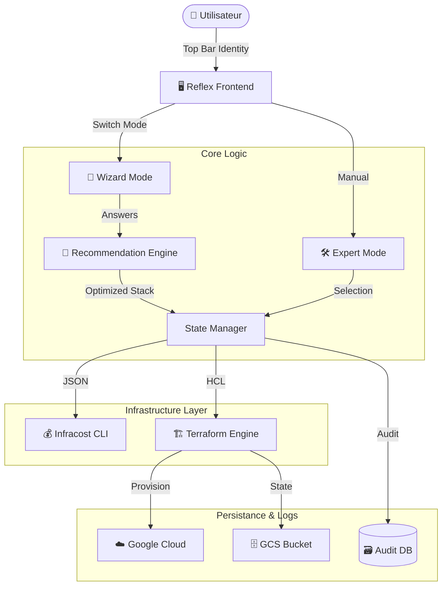

# 🌿 EcoArch Platform: Intelligent FinOps

> **From Zero to Hero** : L'assistant d'infrastructure Cloud qui estime, déploie et audite vos ressources GCP.

**EcoArch** est une plateforme FinOps "Day 0 & Day 2" qui combine un architecte virtuel (Wizard) pour la conception et un contrôle total pour le déploiement. Elle intègre la gestion de la Haute Disponibilité (HA), une isolation multi-utilisateurs et une traçabilité d'audit immuable.


---

## 📑 Sommaire

1. [✨ Fonctionnalités Clés](#-fonctionnalités-clés)
2. [🤖 Architecte Virtuel (Wizard)](#-architecte-virtuel-wizard)
3. [🏗️ Architecture Technique](#️-architecture-technique)
4. [🚀 Installation (Docker)](#-installation-docker)
5. [🛠️ Guide Utilisateur](#️-guide-utilisateur)
6. [🛡️ Gouvernance & Audit](#️-gouvernance--audit)
7. [💡 Options Avancées](#-options-avancées)

---

## ✨ Fonctionnalités Clés

* **🧠 Mode Assistant (IA)** : Un questionnaire intelligent traduit vos besoins métier (Trafic, Criticité) en architecture technique optimisée.
* **🛡️ Haute Disponibilité (HA)** : Génération automatique de clusters (Multi-VMs) et de Load Balancers si la criticité l'exige.
* **💰 Estimation Temps Réel** : Calcul instantané du coût mensuel via Infracost avant tout déploiement.
* **⚡ Auto-Déploiement** : Option pour provisionner l'infrastructure automatiquement si le budget (<50$) est respecté.
* **👤 Multi-Tenant** : Barre d'identité persistante. Chaque session possède son propre State Terraform isolé (UUID).
* **📜 Audit Log Visuel** : Tableau de bord intégré (Data Grid) listant toutes les actions sans accès direct à la BDD.
* **🎨 Design Apple-like** : Interface épurée avec thème clair/sombre, animations fluides et effets glass morphism.
* **🔧 Mode Économie** : Option pour exclure les bases de données SQL et réduire les coûts (~$16/mois d'économie).

---

## 🤖 Architecte Virtuel (Wizard)

EcoArch ne se contente pas d'exécuter, elle conseille. Le moteur de recommandation analyse vos réponses pour dimensionner l'infrastructure.

| Besoin Métier | Traduction Technique EcoArch |
| :--- | :--- |
| **"Trafic Élevé"** | Upgrade CPU (`e2-highcpu`) + Disques SSD |
| **"Données Critiques"** | Base de données HA + Stockage Multi-Régional |
| **"Haute Dispo (SLA)"** | Cluster 2 VMs + Global Load Balancer (HTTP) |

### Options du Wizard

| Option | Description | Impact Coût |
| :--- | :--- | :--- |
| **Inclure une base de données** | Ajoute Cloud SQL PostgreSQL | +~$16/mois |
| **Déployer automatiquement** | Déploie si budget respecté (<$50) | - |

---

## 🏗️ Architecture Technique

Le projet suit une **Clean Architecture** stricte séparant l'interface (Reflex) de la logique (Python) et de l'infrastructure (Terraform).



---

## 🚀 Installation (Docker)

La méthode recommandée pour un environnement isolé et reproductible.

### Prérequis

* Docker & Docker Compose.
* Clé de service GCP (`gcp-key.json`) à la racine.
* Fichier `.env` configuré avec vos clés API (Infracost, Supabase).

### Démarrage Rapide

```bash
# 1. Cloner le projet
git clone [https://gitlab.com/votre-repo/EcoArch.git](https://gitlab.com/votre-repo/EcoArch.git)
cd EcoArch

# 2. Configurer les secrets
cp /path/to/gcp-key.json .
# Assurez-vous que le fichier .env est présent

# 3. Lancer la stack
docker-compose up --build

```

Accédez à l'application : **http://localhost:3000**

---

## 🛠️ Guide Utilisateur

### 1. Identité & Session

En haut de l'écran, utilisez la **Top Bar** pour sélectionner votre profil (ex: *Alice DevOps*) et voir votre ID de session unique.

### 2. Conception (Deux Modes)

* **Mode Assistant** : Répondez aux 4 questions (Env, Trafic, Charge, Criticité). 
  * Cochez "Inclure une base de données" pour ajouter Cloud SQL (~$16/mois).
  * Cochez "Auto-déploiement" pour une expérience fluide.
* **Mode Expert** : Ajustez manuellement chaque ressource (VM, SQL, Storage) dans le panneau de configuration.

### 3. Déploiement

Cliquez sur **DÉPLOYER**.

* Terraform initialise un backend isolé pour votre ID de session.
* Les ressources sont créées sur GCP.
* La console de déploiement affiche les logs en temps réel.
* Le statut passe à "SUCCESS" et reste visible jusqu'à fermeture manuelle.

### 4. Destruction

Pour éviter les coûts inutiles, cliquez sur **DÉTRUIRE L'INFRA** avant de quitter, ou saisissez votre ID de session plus tard pour nettoyer.

---

## 🛡️ Gouvernance & Audit

L'onglet **"Gouvernance & Logs"** offre une vue temps réel sur l'activité de la plateforme :

* **Dashboard Graphique** : Suivi de l'évolution des coûts mensuels avec graphique en camembert.
* **Tableau d'Audit** : Une vue "Data Grid" connectée à Supabase affichant :
  * *Qui* a lancé l'action.
  * *Quoi* (Résumé des ressources, ex: "Cluster HA + LB").
  * *Combien* (Coût estimé).
  * *Quand* et le *Statut* (Succès/Erreur).

---

## 💡 Options Avancées

### Mode Économie (Sans Base de Données)

Pour les environnements de test ou les démos, vous pouvez exclure Cloud SQL :

1. Basculez en **Mode Assistant**
2. **Décochez** "Inclure une base de données"
3. Générez votre stack

**Comparaison des coûts :**

| Configuration | Ressources | Coût mensuel |
| :--- | :--- | :--- |
| Stack complète | VM + SQL + Storage | ~$23.58 |
| Sans DB | VM + Storage | ~$6.91 |
| **Économie** | - | **~$16.66** |

### APIs GCP Requises

Assurez-vous que les APIs suivantes sont activées sur votre projet GCP :

| API | Obligatoire | Usage |
| :--- | :--- | :--- |
| Compute Engine API | ✅ Oui | Création de VMs |
| Cloud Storage API | ✅ Oui | Buckets de stockage |
| Cloud SQL Admin API | ⚠️ Optionnel | Bases de données (désactivable) |

> **Note** : Si l'API Cloud SQL n'est pas activée, décochez "Inclure une base de données" dans le wizard pour éviter les erreurs de déploiement.

