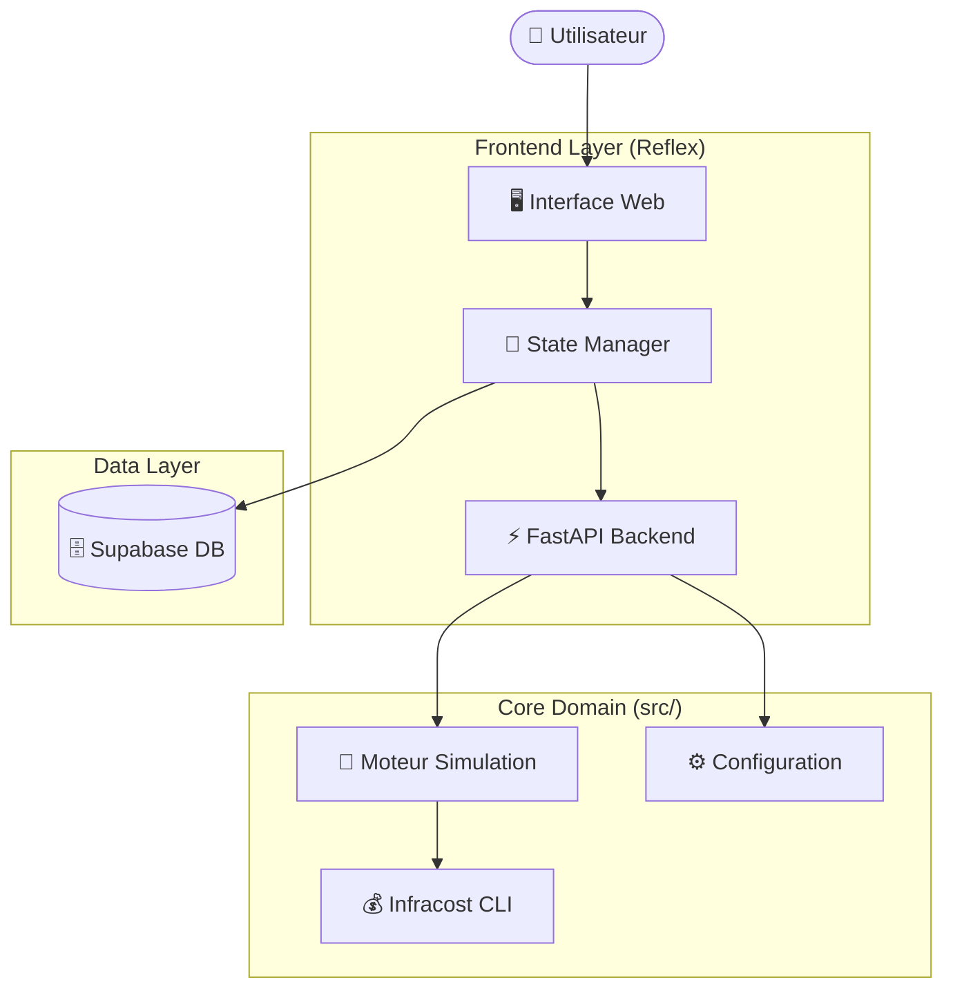

# 🌿 EcoArch Platform: Cloud Cost Intelligence

> **Shift-Left FinOps** : Estimez, contrôlez et optimisez les coûts Cloud avant même le déploiement.

**EcoArch** est une plateforme FinOps moderne qui combine un pipeline CI/CD intelligent (pour bloquer les dépassements budgétaires) et une interface de contrôle "Control Plane" temps réel pour simuler les coûts d'infrastructure.


-5B21B6)


---

## 📑 Sommaire

1. [🏗️ Architecture du Système](#architecture-du-système)
2. [🚀 Control Plane (Frontend Reflex)](#-control-plane-frontend-reflex)
3. [🔄 Pipeline FinOps (CI/CD)](#-pipeline-finops-cicd)
4. [🛠️ Installation & Démarrage](#️-installation--démarrage)
5. [🧪 Tests & Qualité](#-tests--qualité)

---

## 🏗️ Architecture du Système

Le projet suit une **Clean Architecture** stricte, séparant la logique métier (Domain) de l'interface utilisateur (Presentation).



### Structure des Dossiers

```text
EcoArch/
├── src/                  # 🧠 CORE DOMAIN (Logique Métier)
│   ├── simulation.py     # Moteur de simulation (Infracost Wrapper)
│   ├── config.py         # Configuration & Variables d'env
│   └── budget_gate.py    # Script de gouvernance CI/CD
├── frontend/             # ✨ PRESENTATION LAYER (Reflex UI)
│   ├── rxconfig.py       # Configuration du projet Reflex
│   ├── assets/           # Ressources statiques (Images, CSS)
│   └── frontend/         # Code source de l'application
│       ├── state.py      # State Management (Le Cerveau)
│       ├── frontend.py   # Point d'entrée UI & Routing
│       └── components/   # Composants réutilisables (Glassmorphism)
│           └── cards.py  # Cartes KPI & Graphiques
├── infra/                # 🏗️ INFRASTRUCTURE (Terraform)
│   ├── main.tf
│   └── variables.tf
├── tests/                # 🧪 TESTS (Pytest)
├── .env                  # 🔐 Secrets (API Keys)
└── requirements.txt      # 📦 Dépendances Python

```

---

## 🚀 Control Plane (Frontend Reflex)

L'interface utilisateur a été entièrement réécrite avec **Reflex** (Framework Python vers React) pour offrir une expérience "App Native".

### Fonctionnalités

* **Simulateur Temps Réel** : Estimation instantanée des coûts (Compute + Storage) via Infracost.
* **Design System** : Interface moderne (Glassmorphism, Animations, Mode Clair).
* **Gouvernance Dashboard** : Visualisation de l'historique des déploiements (connecté à Supabase).
* **Feedback Immédiat** : Indicateurs visuels de dépassement budgétaire.

---

## 🔄 Pipeline FinOps (CI/CD)

Le workflow CI/CD (GitLab) reste actif pour protéger la branche `main`.

1. **Planification** : Terraform génère le plan d'infrastructure.
2. **Analyse** : Infracost calcule le coût mensuel estimé.
3. **Vérification** : Le script `src/budget_gate.py` compare le coût au budget (ex: 50$).
* ✅ **< Budget** : Merge autorisé.
* ❌ **> Budget** : Pipeline échoué, Merge bloqué.


---

## 🛠️ Installation & Démarrage

### Prérequis

* Python 3.11+
* Clé API Infracost (`INFRACOST_API_KEY`)
* *(Linux/WSL)* Paquet `unzip` installé (`sudo apt install unzip`).

### 1. Installation

```bash
git clone [https://gitlab.com/votre-repo/EcoArch.git](https://gitlab.com/votre-repo/EcoArch.git)
cd EcoArch

# Environnement virtuel
python3 -m venv venv
source venv/bin/activate

# Dépendances
pip install -r requirements.txt

```

### 2. Configuration (.env)

Créez un fichier `.env` à la racine :

```env
INFRACOST_API_KEY="ico-xxxx..."
SUPABASE_URL="[https://xxx.supabase.co](https://xxx.supabase.co)"
SUPABASE_SERVICE_KEY="eyJxh..."
GCP_PROJECT_ID="mon-projet-gcp"

```

### 3. Lancer l'Application

L'application Reflex se lance depuis le dossier `frontend`.

**Pour Linux / macOS :**

```bash
cd frontend
reflex run

```

**Pour WSL (Windows Subsystem for Linux) :**
⚠️ Commande spécifique pour exposer le réseau vers Windows :

```bash
cd frontend
HOSTNAME=0.0.0.0 reflex run --backend-host 0.0.0.0

```

Accédez ensuite à : **[http://localhost:3000](https://www.google.com/search?q=http://localhost:3000)**

---

## 🧪 Tests & Qualité

La logique métier (`src/`) est couverte par des tests unitaires indépendants de l'interface.

```bash
# Lancer tous les tests
pytest

# Voir la couverture
pytest --cov=src tests/

```

### Stack Technique

| Composant | Technologie | Rôle |
| --- | --- | --- |
| **Frontend** | Reflex | UI Réactive (Python -> React) |
| **Backend** | FastAPI | Serveur API (intégré à Reflex) |
| **Pricing** | Infracost | Moteur de coûts Cloud |
| **IaC** | Terraform | Infrastructure Google Cloud |
| **DB** | Supabase | Stockage historique & Logs |

