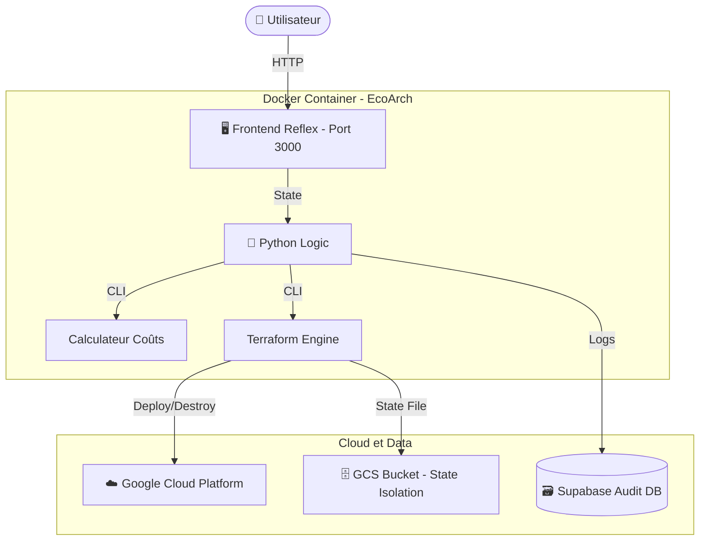

# 🌿 EcoArch Platform: FinOps MVP

> **Shift-Left FinOps** : Estimez, déployez, tracez et détruisez votre infrastructure Cloud avec une gouvernance totale.

**EcoArch** est une plateforme FinOps complète qui permet aux équipes de gérer le cycle de vie de leurs ressources Cloud (GCP) avec une visibilité financière temps réel. Elle intègre une isolation multi-utilisateurs et une traçabilité d'audit immuable.


---

## 📑 Sommaire

1. [✨ Fonctionnalités Clés](#-fonctionnalités-clés)
2. [🏗️ Architecture](#️-architecture)
3. [🚀 Installation (Docker)](#-installation-docker)
4. [🛠️ Guide Utilisateur](#️-guide-utilisateur)
5. [🛡️ Sécurité & Traçabilité](#️-sécurité--traçabilité)

---

## ✨ Fonctionnalités Clés

* **💰 Estimation Temps Réel** : Calcul instantané du coût mensuel via Infracost avant tout déploiement.
* **🚧 Gouvernance Budgétaire** : Blocage automatique des déploiements si le budget (>50$) est dépassé.
* **👤 Multi-Tenant & Isolation** : Chaque session génère un ID unique. Les infrastructures d'Alice n'écrasent jamais celles de Bob.
* **🔄 Cycle de Vie Complet** : Création (Deploy) et Suppression (Destroy) des ressources directement depuis l'interface.
* **📜 Audit Log Immuable** : Traçabilité complète dans Supabase (Qui a déployé quoi, quand et pour combien ?).
* **⚡ Streaming de Logs** : Terminal WebSocket affichant les actions Terraform en direct.

---

## 🏗️ Architecture

Le projet repose sur une architecture conteneurisée orchestrée par Docker Compose.



---

## 🚀 Installation (Docker)

C'est la méthode recommandée. Plus besoin d'installer Python ou Terraform localement.

### Prérequis

* Docker & Docker Compose installés.
* Un compte Google Cloud avec une clé de service JSON (`gcp-key.json`).
* Une clé API Infracost et un projet Supabase.

### 1. Clonage & Configuration

```bash
git clone https://gitlab.com/votre-repo/EcoArch.git
cd EcoArch

# Placez votre clé GCP à la racine
cp /chemin/vers/votre/gcp-key.json .
```

### 2. Variables d'environnement

Créez un fichier `.env` à la racine :

```env
INFRACOST_API_KEY="ico-xxxx..."
SUPABASE_URL="https://xxx.supabase.co"
SUPABASE_SERVICE_KEY="eyJxh..."
GCP_PROJECT_ID="votre-projet-id"
TERRAFORM_STATE_BUCKET="votre-bucket-tfstate"
```

### 3. Démarrage

```bash
docker-compose up --build
```

Accédez à l'application : **http://localhost:3000**

---

## 🛠️ Guide Utilisateur

### 1. Simulation

Choisissez vos ressources (VM, SQL, Storage). Le prix se met à jour. Si le budget est dépassé, le bouton de déploiement se verrouille.

### 2. Déploiement (Deploy)

Cliquez sur **DÉPLOYER**.

* L'app génère un ID de session unique.
* Terraform provisionne les ressources sur GCP.
* Une entrée "PENDING" puis "SUCCESS" est créée dans Supabase.

### 3. Récupération & Destruction (Destroy)

Pour supprimer une infrastructure :

* Si vous êtes dans la même session : Cliquez sur **DÉTRUIRE L'INFRA**.
* Si vous revenez plus tard : Collez l'**ID INFRA** (ex: `b4810762`) dans le champ dédié et cliquez sur Détruire.

---

## 🛡️ Sécurité & Traçabilité

Le fichier `state.py` gère l'identité de l'utilisateur.
Chaque action Terraform est isolée dans un préfixe GCS spécifique : `terraform/state/{session_id}/default.tfstate`.

* **Aucun conflit** de fichier state entre utilisateurs.
* **Nettoyage ciblé** : La destruction ne touche que les ressources de l'ID spécifié.


