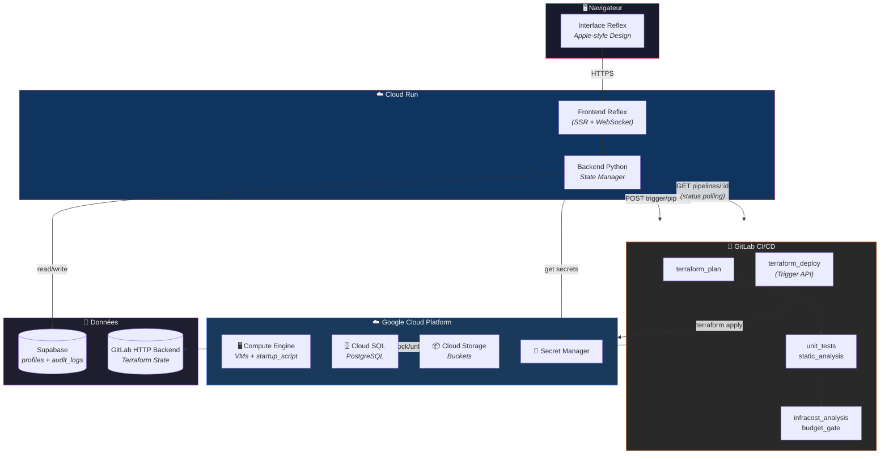
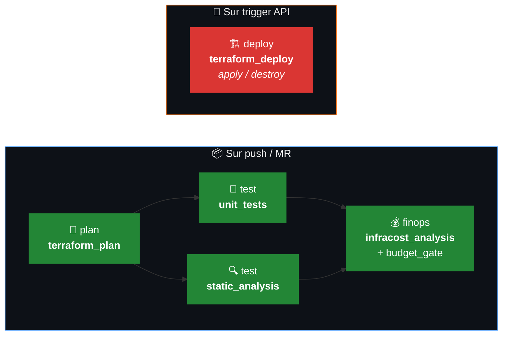
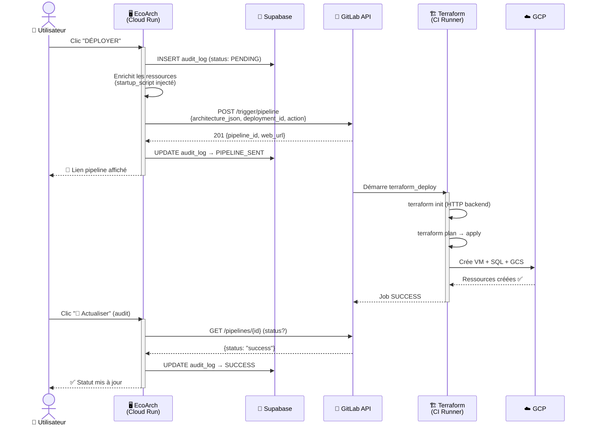
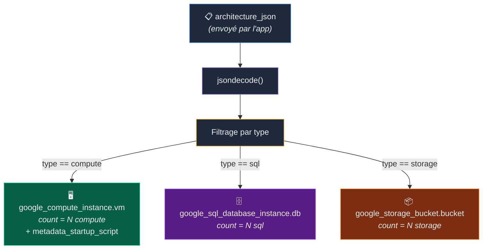
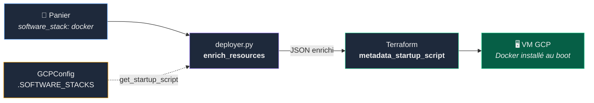
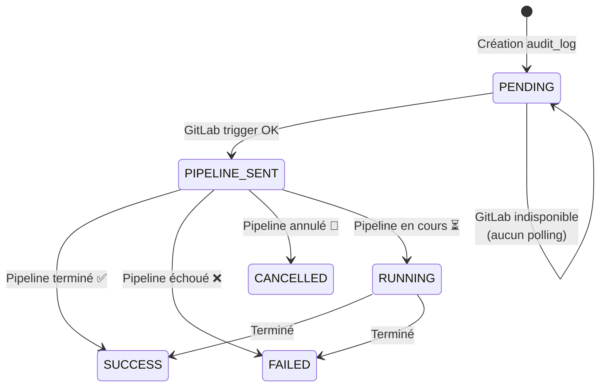

# 🌿 EcoArch — Plateforme FinOps Intelligente

> **From Zero to Hero** : Concevez, estimez, déployez et auditez vos infrastructures GCP — le tout depuis une interface unique.

**EcoArch** est une plateforme FinOps « Day 0 → Day 2 » qui combine un architecte virtuel (Wizard IA), un mode Expert granulaire, un pipeline GitLab CI/CD complet (Terraform + Infracost), et une traçabilité d'audit temps réel.


---

## 📑 Table des matières

1. [Architecture Globale](#-architecture-globale)
2. [Arborescence du Projet](#-arborescence-du-projet)
3. [Pipeline CI/CD](#-pipeline-cicd)
4. [Flux de Déploiement](#-flux-de-déploiement)
5. [Terraform Dynamique](#-terraform-dynamique)
6. [Software Stacks (Startup Scripts)](#-software-stacks-startup-scripts)
7. [Audit & Status Polling](#-audit--status-polling)
8. [Fonctionnalités Clés](#-fonctionnalités-clés)
9. [Installation & Configuration](#-installation--configuration)
10. [Guide Utilisateur](#-guide-utilisateur)
11. [Tests](#-tests)
12. [Secrets & Sécurité](#-secrets--sécurité)
13. [APIs GCP Requises](#-apis-gcp-requises)

---

## 🏗️ Architecture Globale



---

## 📂 Arborescence du Projet

```
EcoArch/
├── .gitlab-ci.yml          # Pipeline CI/CD (4 stages, 4 jobs)
├── Dockerfile              # Build multi-stage (Python 3.11 + Terraform + Infracost)
├── deploy.sh               # Script de déploiement Cloud Run (auto-versioning)
├── docker-compose.yml      # Stack développement local
├── requirements.txt        # Dépendances Python (production)
├── requirements-dev.txt    # Dépendances dev (pytest, ruff, mypy)
├── .env.example            # Template des variables d'environnement
│
├── frontend/               # Application Reflex
│   ├── rxconfig.py         # Configuration Reflex (app_name, api_url)
│   └── frontend/
│       ├── frontend.py     # Routes & layout principal
│       ├── state.py        # État global (840+ lignes) — cœur de l'app
│       ├── styles.py       # Thème Apple-style + couleurs recharts
│       └── components/
│           ├── topbar.py   # Barre d'identité utilisateur
│           ├── header.py   # En-tête avec logo & mode switch
│           ├── wizard.py   # Questionnaire IA (5 questions)
│           ├── form.py     # Formulaire mode Expert
│           ├── cards.py    # Cartes de résumé (coût, budget, ressources)
│           ├── resources.py# Liste du panier
│           ├── pricing.py  # Graphique donut recharts (coûts par ressource)
│           ├── stats.py    # Statistiques de session
│           ├── logs.py     # Console de déploiement temps réel
│           └── audit_view.py # Tableau d'audit (Data Grid)
│
├── src/                    # Logique métier
│   ├── config.py           # Configuration centralisée + GCPConfig (SOFTWARE_STACKS)
│   ├── simulation.py       # Simulateur Infracost (estimation des coûts)
│   ├── recommendation.py   # Moteur de recommandation IA (Wizard → architecture)
│   ├── deployer.py         # Trigger GitLab CI/CD + polling statut pipeline
│   ├── parser.py           # Parser du rapport Infracost JSON
│   ├── budget_gate.py      # Gate budgétaire (seuil configurable)
│   ├── gitlab_comment.py   # Commentaire MR automatique (rapport coûts)
│   └── stubs.py            # Stubs pour dev frontend sans backend
│
├── infra/                  # Infrastructure as Code
│   ├── main.tf             # Ressources dynamiques (VM, SQL, GCS via jsondecode)
│   ├── variables.tf        # Variables Terraform (architecture_json, deployment_id…)
│   ├── providers.tf        # Provider Google ~> 6.15.0
│   └── outputs.tf          # Outputs (IPs, noms, deployment_id)
│
├── tests/                  # Suite de tests (195 tests)
│   ├── test_deployer.py    # Tests trigger + enrichissement + polling (38 tests)
│   ├── test_simulation.py  # Tests simulateur Infracost
│   ├── test_parser.py      # Tests parser rapport
│   ├── test_recommendation.py # Tests moteur de recommandation
│   └── test_state.py       # Tests état Reflex (login, panier, audit)
│
├── AUDIT_SECURITE_QUALITE.md  # Rapport d'audit sécurité & qualité
└── RAPPORT_DEPLOIEMENT.md     # Historique de déploiement & troubleshooting
```

---

## 🔄 Pipeline CI/CD

Le pipeline GitLab s'exécute en **4 stages** selon la source de déclenchement :



| Stage | Job | Déclencheur | Description |
|-------|-----|-------------|-------------|
| `plan` | `terraform_plan` | push / MR | `terraform init` + `plan` → artifact `plan.json` |
| `test` | `unit_tests` | push / MR | `pytest` — 195 tests, rapport JUnit |
| `test` | `static_analysis` | push / MR | `mypy` + `ruff` (allow_failure) |
| `finops` | `infracost_analysis` | push / MR | Infracost breakdown + `budget_gate.py` (seuil 50$) |
| `deploy` | `terraform_deploy` | trigger / web | `terraform apply` ou `destroy` selon `ECOARCH_ACTION` |

**Authentification GCP** : Workload Identity Federation (pas de clé JSON en CI).

---

## 🚀 Flux de Déploiement

Voici le parcours complet d'un déploiement déclenché depuis l'interface :



---

## 🧱 Terraform Dynamique

Le fichier `main.tf` ne contient plus de ressource statique. Il décode le JSON du panier utilisateur et crée dynamiquement chaque ressource :



**Variables Terraform** (toutes injectées par le pipeline) :

| Variable | Source | Description |
|----------|--------|-------------|
| `architecture_json` | `TF_VAR_architecture_json` | JSON du panier (ressources + startup_script) |
| `deployment_id` | `TF_VAR_deployment_id` | ID unique de session (UUID court) |
| `project_id` | `TF_VAR_project_id` | Projet GCP cible |
| `region` / `zone` | Variables globales CI | `us-central1` / `us-central1-a` |

---

## 📦 Software Stacks (Startup Scripts)

Chaque VM peut être provisionnée avec un logiciel pré-installé via `metadata_startup_script`. Le script est injecté dans le JSON par `deployer.py` depuis `GCPConfig.SOFTWARE_STACKS` :

| Stack ID | Nom | Logiciels installés |
|----------|-----|---------------------|
| `none` | VM vide | — |
| `web-nginx` | Serveur Web (Nginx) | Nginx + Certbot HTTPS |
| `web-apache` | Serveur Web (Apache) | Apache2 + mod_ssl |
| `nodejs` | Node.js Runtime | Node.js 20 LTS + npm + PM2 |
| `python-django` | Python Django | Python 3.11 + Django + Gunicorn + Nginx |
| `python-flask` | Python Flask | Python 3.11 + Flask + Gunicorn |
| `docker` | Docker | Docker Engine + Docker Compose |
| `lamp` | LAMP Stack | Apache + MySQL + PHP |
| `lemp` | LEMP Stack | Nginx + MySQL + PHP-FPM |
| `monitoring` | Monitoring | Prometheus + Node Exporter + Grafana |




## 📊 Audit & Status Polling

Le système d'audit trace chaque action (deploy/destroy) dans Supabase. Le statut est mis à jour en interrogeant l'API GitLab :



**Colonnes `audit_logs`** (Supabase) :

| Colonne | Type | Description |
|---------|------|-------------|
| `id` | int | Clé primaire auto |
| `user` | text | Utilisateur ayant déclenché l'action |
| `action` | text | `DEPLOY` ou `DESTROY` |
| `resources_summary` | text | Résumé du panier (ex: `[abc123] VM e2-medium (Docker), GCS STANDARD`) |
| `total_cost` | float | Coût mensuel estimé |
| `status` | text | `PENDING` → `PIPELINE_SENT` → `SUCCESS` / `FAILED` / `CANCELLED` |
| `pipeline_url` | text | Lien cliquable vers le pipeline GitLab |
| `created_at` | timestamp | Date de création |

---

## ✨ Fonctionnalités Clés

| Fonctionnalité | Description |
|----------------|-------------|
| 🧠 **Wizard IA** | Questionnaire (5 questions) → architecture optimisée automatiquement |
| 🛠️ **Mode Expert** | Sélection manuelle des VMs, Cloud SQL, Cloud Storage, software stack |
| 💰 **Estimation temps réel** | Calcul Infracost avant déploiement (graphique donut interactif) |
| 🚀 **Déploiement GitLab** | Trigger API → pipeline Terraform → VMs créées avec logiciels pré-installés |
| 🔥 **Destruction** | Trigger API → `terraform destroy` → nettoyage complet |
| 📊 **Audit immuable** | Tableau Supabase avec polling GitLab (PENDING → SUCCESS/FAILED) |
| 🔒 **Budget Gate** | Seuil configurable (défaut: 50$) — bloque le déploiement si dépassé |
| 👤 **Multi-tenant** | Chaque session = ID unique, Terraform state isolé |
| 🎨 **Design Apple-style** | Thème clair/sombre, glass morphism, animations fluides |

---

## 🚀 Installation & Configuration

### Prérequis

- **Python 3.11+**
- **Docker** (pour le build Cloud Run ou le dev local)
- **Compte GCP** avec projet configuré
- **Compte GitLab** avec CI/CD activé
- **Compte Supabase** (table `profiles` + `audit_logs`)

### Développement local

```bash
# 1. Cloner le projet
git clone git@gitlab.com:HichOps/ecoarch.git
cd EcoArch

# 2. Environnement virtuel
python3 -m venv venv && source venv/bin/activate

# 3. Dépendances
pip install -r requirements.txt -r requirements-dev.txt
pip install -r frontend/requirements.txt

# 4. Configuration
cp .env.example .env
# → Remplir les clés : SUPABASE_URL, SUPABASE_SERVICE_KEY, INFRACOST_API_KEY,
#   GITLAB_TRIGGER_TOKEN, GITLAB_API_TOKEN

# 5. Lancer l'app
cd frontend && reflex run
```

Accès : **http://localhost:3000**

### Développement avec Docker

```bash
docker compose up --build
```

### Déploiement Cloud Run (production)

```bash
# Le script gère : auto-versioning, tests, Docker build, Cloud Run deploy
bash deploy.sh patch   # patch | minor | major
```

---

## 🛠️ Guide Utilisateur

### 1. Connexion

Saisissez votre identifiant dans la Top Bar. Le profil est vérifié dans Supabase (`profiles`).

### 2. Conception

- **Mode Assistant (Wizard)** : Répondez aux 5 questions métier → l'IA génère l'architecture.
- **Mode Expert** : Ajoutez manuellement chaque ressource (VM, SQL, Storage) avec la stack logicielle.

### 3. Estimation

Le coût s'affiche en temps réel dans le graphique donut. Chaque ressource a sa propre couleur par type.

### 4. Déploiement

Cliquez sur **DÉPLOYER** → le pipeline GitLab est déclenché. Suivez le lien dans la console de logs.

### 5. Audit

Cliquez sur **🔄 Actualiser** dans l'onglet Audit → les statuts PENDING/PIPELINE_SENT sont interrogés auprès de GitLab et mis à jour automatiquement.

### 6. Destruction

Cliquez sur **DÉTRUIRE L'INFRA** ou saisissez un Deployment ID précédent.

---

## 🧪 Tests

```bash
# Lancer tous les tests (195)
python -m pytest tests/ -v

# Avec couverture
python -m pytest tests/ --cov=src --cov-report=term-missing

# Un fichier spécifique
python -m pytest tests/test_deployer.py -v
```

| Fichier | Tests | Couverture |
|---------|-------|------------|
| `test_deployer.py` | 38 | trigger, enrichissement, polling, extraction |
| `test_simulation.py` | 52 | fallback, Infracost mock, edge cases |
| `test_parser.py` | 33 | parsing rapport JSON |
| `test_recommendation.py` | 38 | moteur IA, tous les scénarios |
| `test_state.py` | 34 | login, panier, audit, wizard |

---

## 🔐 Secrets & Sécurité

Tous les secrets sensibles sont stockés dans **GCP Secret Manager** en production. En dev local, ils sont lus depuis le `.env`.

| Secret | Usage | Scope |
|--------|-------|-------|
| `SUPABASE_URL` | URL Supabase | — |
| `SUPABASE_SERVICE_KEY` | Clé service Supabase | write |
| `infracost-api-key` | Clé API Infracost | — |
| `GITLAB_TRIGGER_TOKEN` | Token trigger pipeline | trigger |
| `GITLAB_API_TOKEN` | Token lecture statut pipeline | `read_api` |

**Bonnes pratiques appliquées** :
- ❌ Aucune clé JSON GCP dans le repo (Workload Identity Federation en CI)
- ✅ `.gitignore` exclut `*.tfvars`, `.env`, `gcp-key.json*`
- ✅ Authentification HMAC optionnelle (`AUTH_SECRET_KEY`)
- ✅ Terraform state dans GitLab HTTP Backend (pas de bucket public)

---

## ☁️ APIs GCP Requises

| API | Obligatoire | Usage |
|-----|:-----------:|-------|
| Compute Engine API | ✅ | Création de VMs |
| Cloud Storage API | ✅ | Buckets de stockage |
| Cloud SQL Admin API | ⚠️ Optionnel | Bases de données (désactivable dans le Wizard) |
| Secret Manager API | ✅ | Lecture des secrets en production |
| Cloud Run Admin API | ✅ | Déploiement de l'application |
| Artifact Registry API | ✅ | Stockage des images Docker |
| IAM Service Account Credentials API | ✅ | Workload Identity Federation (CI/CD) |

---

<p align="center">
  <b>EcoArch v0.0.18</b> — Built with 🌿 by <a href="https://gitlab.com/HichOps">HichOps</a>
</p>

