# 🌿 EcoArch — Plateforme GreenOps & FinOps Intelligente

> **From Zero to Hero** : Concevez, estimez, déployez et auditez vos infrastructures GCP — le tout depuis une interface unique, avec un impact carbone maîtrisé.

**EcoArch** est une plateforme GreenOps & FinOps « Day 0 → Day 2 » qui combine un architecte virtuel (Wizard IA), un mode Expert granulaire, un pipeline GitLab CI/CD complet (Terraform + Infracost), une traçabilité d'audit temps réel, et un moteur de scoring carbone.


---

## 📑 Table des matières

1. [Architecture Globale](#-architecture-globale)
2. [Arborescence du Projet](#-arborescence-du-projet)
3. [Couche Services (Clean Architecture)](#-couche-services-clean-architecture)
4. [Pipeline CI/CD](#-pipeline-cicd)
5. [Flux de Déploiement](#-flux-de-déploiement)
6. [Terraform Dynamique](#-terraform-dynamique)
7. [Software Stacks (Startup Scripts)](#-software-stacks-startup-scripts)
8. [GreenOps & Carbon Scoring](#-greenops--carbon-scoring)
9. [Audit & Status Polling](#-audit--status-polling)
10. [Sécurité & Robustesse](#-sécurité--robustesse)
11. [Fonctionnalités Clés](#-fonctionnalités-clés)
12. [Installation & Configuration](#-installation--configuration)
13. [Guide Utilisateur](#-guide-utilisateur)
14. [Tests](#-tests)
15. [Secrets & Sécurité](#-secrets--sécurité)
16. [APIs GCP Requises](#-apis-gcp-requises)

---

## 🏗️ Architecture Globale

```mermaid
graph TB
    subgraph CLIENT["🖥️ Navigateur"]
        UI["Interface Reflex<br/><i>Apple-style Design</i>"]
    end

    subgraph CLOUDRUN["☁️ Cloud Run"]
        direction TB
        FE["Frontend Reflex<br/><i>(SSR + WebSocket)</i>"]
        BE["Backend Python<br/><i>State Manager</i>"]
        SVC["Services Layer<br/><i>Auth / Audit / Recommendation</i>"]
        SEC["Security Layer<br/><i>InputSanitizer</i>"]
        FE <--> BE
        BE --> SVC
        BE --> SEC
    end

    subgraph GITLAB["🦊 GitLab CI/CD"]
        direction TB
        PLAN["terraform_plan"]
        TEST["unit_tests<br/>static_analysis"]
        FINOPS["infracost_analysis<br/>budget_gate"]
        DEPLOY["terraform_deploy<br/><i>(Trigger API)</i>"]
    end

    subgraph GCP["☁️ Google Cloud Platform"]
        direction TB
        VM["🖥️ Compute Engine<br/><i>VMs + startup_script</i>"]
        SQL["🗄️ Cloud SQL<br/><i>PostgreSQL</i>"]
        GCS["📦 Cloud Storage<br/><i>Buckets</i>"]
        SM["🔑 Secret Manager"]
    end

    subgraph DATA["💾 Données"]
        SUPA[("Supabase<br/><i>profiles + audit_logs</i>")]
        TFSTATE[("GitLab HTTP Backend<br/><i>Terraform State</i>")]
    end

    UI -- "HTTPS" --> FE
    BE -- "POST trigger/pipeline" --> GITLAB
    BE -- "GET pipelines/:id<br/><i>(status polling)</i>" --> GITLAB
    DEPLOY -- "terraform apply" --> GCP
    SVC -- "read/write" --> SUPA
    SVC -- "get secrets" --> SM
    GITLAB -- "state lock/unlock" --> TFSTATE
    PLAN --> TEST --> FINOPS

    style CLIENT fill:#1a1a2e,stroke:#e94560,color:#eee
    style CLOUDRUN fill:#0f3460,stroke:#e94560,color:#eee
    style GITLAB fill:#292929,stroke:#fc6d26,color:#eee
    style GCP fill:#1a3a5c,stroke:#4285f4,color:#eee
    style DATA fill:#1e1e2e,stroke:#a855f7,color:#eee
```



---

## 📂 Arborescence du Projet

```
EcoArch/
├── .gitlab-ci.yml          # Pipeline CI/CD (4 stages, 5 jobs)
├── Dockerfile              # Build multi-stage (Python 3.11 + Terraform + Infracost)
├── deploy.sh               # Script de déploiement Cloud Run (enrichi: smoke tests, rollback auto)
├── docker-compose.yml      # Stack développement local
├── requirements.txt        # Dépendances Python (production)
├── requirements-dev.txt    # Dépendances dev (pytest, ruff, mypy)
│
├── frontend/               # Application Reflex
│   ├── rxconfig.py         # Configuration Reflex (app_name, api_url)
│   └── frontend/
│       ├── frontend.py     # Routes & layout principal
│       ├── state.py        # État UI uniquement (délègue aux Services)
│       ├── styles.py       # Thème Apple-style + couleurs recharts
│       └── components/
│           ├── topbar.py   # Barre d'identité utilisateur
│           ├── header.py   # En-tête avec logo & mode switch
│           ├── wizard.py   # Questionnaire IA (5 questions)
│           ├── form.py     # Formulaire mode Expert
│           ├── cards.py    # Cartes de résumé (coût, budget, ressources)
│           ├── resources.py# Liste du panier
│           ├── pricing.py  # Graphique donut recharts (coûts par ressource)
│           ├── stats.py    # Statistiques de session
│           ├── logs.py     # Console de déploiement temps réel
│           └── audit_view.py # Tableau d'audit (Data Grid)
│
├── src/                    # Logique métier (Clean Architecture)
│   ├── config.py           # Configuration centralisée + GCPConfig + Secret Manager
│   ├── security.py         # InputSanitizer (whitelist, validation HCL-safe)
│   ├── simulation.py       # Simulateur Infracost (estimation des coûts)
│   ├── recommendation.py   # Moteur GreenOps (Wizard → architecture + émissions CO2)
│   ├── deployer.py         # Trigger GitLab CI/CD + polling statut pipeline
│   ├── parser.py           # Parser du rapport Infracost JSON
│   ├── budget_gate.py      # Gate budgétaire (seuil configurable)
│   ├── gitlab_comment.py   # Commentaire MR automatique (rapport coûts)
│   ├── stubs.py            # Stubs pour dev frontend sans backend
│   └── services/           # Services métier découplés
│       ├── auth_service.py # Authentification (Supabase + HMAC)
│       └── audit_service.py# Logs d'audit (CRUD Supabase + sync GitLab)
│
├── infra/                  # Infrastructure as Code
│   ├── main.tf             # Ressources dynamiques (VM, SQL, GCS via jsondecode)
│   ├── variables.tf        # Variables Terraform (architecture_json, deployment_id…)
│   ├── providers.tf        # Provider Google ~> 6.15.0
│   └── outputs.tf          # Outputs (IPs, noms, deployment_id)
│
├── tests/                  # Suite de tests (195 tests)
│   ├── test_deployer.py    # Tests trigger + enrichissement + polling
│   ├── test_simulation.py  # Tests simulateur Infracost
│   ├── test_parser.py      # Tests parser rapport
│   ├── test_recommendation.py # Tests moteur GreenOps + sobriety score
│   ├── test_security.py    # Tests InputSanitizer (whitelist, injections)
│   └── test_state.py       # Tests état Reflex (login, panier, audit, wizard)
│
├── GREENOPS.md             # Manifeste GreenOps (méthodologie carbone)
├── KAIZEN_REPORT.md        # Tableau de bord amélioration continue
├── AUDIT_SECURITE_QUALITE.md # Rapport d'audit sécurité & qualité
└── RAPPORT_DEPLOIEMENT.md  # Historique de déploiement & troubleshooting
```

---

## 🧩 Couche Services (Clean Architecture)

Le projet applique une séparation stricte UI / Métier / Infrastructure :

```mermaid
graph LR
    subgraph UI["🖥️ UI Layer (Reflex)"]
        STATE["State<br/><i>state.py</i>"]
    end

    subgraph SERVICES["⚙️ Services Layer"]
        AUTH["AuthService<br/><i>auth_service.py</i>"]
        AUDIT["AuditService<br/><i>audit_service.py</i>"]
        RECO["RecommendationEngine<br/><i>recommendation.py</i>"]
        SIM["InfracostSimulator<br/><i>simulation.py</i>"]
        DEPLOY["Deployer<br/><i>deployer.py</i>"]
    end

    subgraph SECURITY["🔒 Security Layer"]
        SANITIZER["InputSanitizer<br/><i>security.py</i>"]
        CONFIG["Config<br/><i>config.py</i>"]
    end

    subgraph INFRA["☁️ Infrastructure"]
        SUPA[("Supabase")]
        GL[("GitLab API")]
        GCP_SM[("Secret Manager")]
    end

    STATE --> AUTH
    STATE --> AUDIT
    STATE --> RECO
    STATE --> SIM
    STATE --> DEPLOY
    STATE --> SANITIZER
    AUTH --> CONFIG
    AUDIT --> CONFIG
    CONFIG --> GCP_SM
    AUTH --> SUPA
    AUDIT --> SUPA
    AUDIT --> GL
    DEPLOY --> GL

    style UI fill:#0f3460,stroke:#e94560,color:#eee
    style SERVICES fill:#1a3a5c,stroke:#4285f4,color:#eee
    style SECURITY fill:#7c2d12,stroke:#fb923c,color:#eee
    style INFRA fill:#1e1e2e,stroke:#a855f7,color:#eee
```



| Service | Fichier | Responsabilité |
| :--- | :--- | :--- |
| **AuthService** | `src/services/auth_service.py` | Vérification Supabase, tokens HMAC, mode dégradé |
| **AuditService** | `src/services/audit_service.py` | CRUD audit_logs, sync statut pipeline GitLab |
| **RecommendationEngine** | `src/recommendation.py` | Wizard → architecture, Green Score, émissions CO2 |
| **InfracostSimulator** | `src/simulation.py` | Estimation coûts (Infracost CLI ou fallback) |
| **InputSanitizer** | `src/security.py` | Whitelist stricte, validation Terraform-safe |
| **Config** | `src/config.py` | Secrets (GCP Secret Manager), variables centralisées |

---

## 🔄 Pipeline CI/CD

Le pipeline GitLab s'exécute en **4 stages** selon la source de déclenchement :

```mermaid
graph LR
    subgraph PUSH["📦 Sur push / MR"]
        direction LR
        P1["🔧 plan<br/><b>terraform_plan</b>"]
        P2a["🧪 test<br/><b>unit_tests</b>"]
        P2b["🔍 test<br/><b>static_analysis</b>"]
        P3["💰 finops<br/><b>infracost_analysis</b><br/>+ budget_gate"]
        P1 --> P2a & P2b --> P3
    end

    subgraph TRIGGER["🚀 Sur trigger API"]
        direction LR
        T1["🏗️ deploy<br/><b>terraform_deploy</b><br/><i>apply / destroy</i>"]
    end

    style PUSH fill:#0d1117,stroke:#58a6ff,color:#eee
    style TRIGGER fill:#0d1117,stroke:#f97316,color:#eee
```



| Stage | Job | Déclencheur | Description |
|-------|-----|-------------|-------------|
| `plan` | `terraform_plan` | push / MR | `terraform init` + `plan` → artifact `plan.json` |
| `test` | `unit_tests` | push / MR | `pytest` — 195 tests, rapport JUnit |
| `test` | `static_analysis` | push / MR | `mypy` + `ruff` (allow_failure) |
| `finops` | `infracost_analysis` | push / MR | Infracost breakdown + `budget_gate.py` (seuil 50$) |
| `deploy` | `cloud_run_deploy` | manual (main) | Build Docker + deploy Cloud Run |
| `deploy` | `terraform_deploy` | trigger / web | `terraform apply` ou `destroy` selon `ECOARCH_ACTION` |

**Authentification GCP** : Workload Identity Federation (pas de clé JSON en CI).

---

## 🚀 Flux de Déploiement

```mermaid
sequenceDiagram
    actor User as 👤 Utilisateur
    participant App as 🖥️ EcoArch<br/>(Cloud Run)
    participant Audit as 📋 AuditService
    participant Supa as 💾 Supabase
    participant GL as 🦊 GitLab API
    participant TF as 🏗️ Terraform<br/>(CI Runner)
    participant GCP as ☁️ GCP

    User->>App: Clic "DÉPLOYER"
    activate App
    App->>Audit: create_log(DEPLOY, PENDING)
    Audit->>Supa: INSERT audit_log
    App->>App: Enrichit les ressources<br/>(startup_script injecté)
    App->>GL: POST /trigger/pipeline<br/>{architecture_json, deployment_id, action}
    GL-->>App: 201 {pipeline_id, web_url}
    App->>Audit: update_log(PIPELINE_SENT)
    Audit->>Supa: UPDATE audit_log
    App-->>User: 🔗 Lien pipeline affiché
    deactivate App

    GL->>TF: Démarre terraform_deploy
    activate TF
    TF->>TF: terraform init (HTTP backend)
    TF->>TF: terraform plan → apply
    TF->>GCP: Crée VM + SQL + GCS
    GCP-->>TF: Ressources créées ✅
    TF-->>GL: Job SUCCESS
    deactivate TF

    User->>App: Clic "🔄 Actualiser" (audit)
    activate App
    App->>Audit: sync_pipeline_statuses()
    Audit->>GL: GET /pipelines/{id}
    GL-->>Audit: {status: "success"}
    Audit->>Supa: UPDATE audit_log → SUCCESS
    App-->>User: ✅ Statut mis à jour
    deactivate App
```



---

## 🧱 Terraform Dynamique

Le fichier `main.tf` ne contient plus de ressource statique. Il décode le JSON du panier utilisateur et crée dynamiquement chaque ressource :

```mermaid
graph TD
    JSON["📋 architecture_json<br/><i>(envoyé par l'app)</i>"]
    DECODE["jsondecode()"]
    FILTER["Filtrage par type"]

    VM["🖥️ google_compute_instance.vm<br/><i>count = N compute</i><br/>+ metadata_startup_script<br/>+ label carbon_awareness"]
    SQL["🗄️ google_sql_database_instance.db<br/><i>count = N sql</i>"]
    GCS["📦 google_storage_bucket.bucket<br/><i>count = N storage</i>"]

    JSON --> DECODE --> FILTER
    FILTER -->|type == compute| VM
    FILTER -->|type == sql| SQL
    FILTER -->|type == storage| GCS

    style JSON fill:#1e293b,stroke:#60a5fa,color:#eee
    style DECODE fill:#1e293b,stroke:#a78bfa,color:#eee
    style FILTER fill:#1e293b,stroke:#f59e0b,color:#eee
    style VM fill:#065f46,stroke:#34d399,color:#eee
    style SQL fill:#581c87,stroke:#c084fc,color:#eee
    style GCS fill:#7c2d12,stroke:#fb923c,color:#eee
```



| Variable | Source | Description |
|----------|--------|-------------|
| `architecture_json` | `TF_VAR_architecture_json` | JSON du panier (ressources + startup_script) |
| `deployment_id` | `TF_VAR_deployment_id` | ID unique de session (UUID court) |
| `project_id` | `TF_VAR_project_id` | Projet GCP cible |
| `region` / `zone` | Variables globales CI | `us-central1` / `us-central1-a` |

---

## 📦 Software Stacks (Startup Scripts)

Chaque VM peut être provisionnée avec un logiciel pré-installé via `metadata_startup_script` :

| Stack ID | Nom | Logiciels installés |
|----------|-----|---------------------|
| `none` | VM vide | — |
| `web-nginx` | Serveur Web (Nginx) | Nginx + Certbot HTTPS |
| `web-apache` | Serveur Web (Apache) | Apache2 + mod_ssl |
| `nodejs` | Node.js Runtime | Node.js 20 LTS + npm + PM2 |
| `python-django` | Python Django | Python 3.11 + Django + Gunicorn + Nginx |
| `python-flask` | Python Flask | Python 3.11 + Flask + Gunicorn |
| `docker` | Docker | Docker Engine + Docker Compose |
| `lamp` | LAMP Stack | Apache + MySQL + PHP |
| `lemp` | LEMP Stack | Nginx + MySQL + PHP-FPM |
| `monitoring` | Monitoring | Prometheus + Node Exporter + Grafana |

---

## 🌍 GreenOps & Carbon Scoring

EcoArch intègre un moteur GreenOps qui calcule en temps réel l'empreinte carbone de chaque architecture.

> Voir **[GREENOPS.md](GREENOPS.md)** pour la méthodologie scientifique complète.

| Indicateur | Calcul | Affichage UI |
| :--- | :--- | :--- |
| **Green Score** (A→E) | vCPU + RAM + stockage + env + région | Badge coloré |
| **kgCO2eq/mois** | kWh × gCO2/kWh / 1000 | Tooltip du badge |
| **Équivalence km** | kgCO2eq × 5.0 | Tooltip du badge |
| **Region Alert** | Région classée `high` | Suggestion de migration |
| **Sobriety Guardrail** | Score ≥ C | Alerte de right-sizing |

### Defaults Green by Design

| Paramètre | Valeur par défaut | Justification |
| :--- | :--- | :--- |
| Machine family | E2 (shared-core) | Meilleure efficacité énergétique |
| Disk type | `pd-standard` (HDD) | Empreinte réduite vs SSD |
| Terraform label | `carbon_awareness` | Traçabilité dans GCP |

---

## 📊 Audit & Status Polling

```mermaid
stateDiagram-v2
    [*] --> PENDING: AuditService.create_log()
    PENDING --> PIPELINE_SENT: GitLab trigger OK
    PIPELINE_SENT --> SUCCESS: Pipeline terminé ✅
    PIPELINE_SENT --> FAILED: Pipeline échoué ❌
    PIPELINE_SENT --> CANCELLED: Pipeline annulé 🚫
    PIPELINE_SENT --> RUNNING: Pipeline en cours ⏳
    RUNNING --> SUCCESS: Terminé
    RUNNING --> FAILED: Terminé

    PENDING --> PENDING: GitLab indisponible<br/>(aucun polling)
```



Le polling utilise un **backoff exponentiel** (10s → 120s) pour réduire les appels API inutiles (GreenOps).

---

## 🔐 Sécurité & Robustesse

### InputSanitizer : Neutralisation des Injections HCL

Toutes les valeurs utilisateur destinées à Terraform passent par `InputSanitizer` (`src/security.py`) qui applique :

| Protection | Mécanisme | Champs protégés |
| :--- | :--- | :--- |
| **Whitelist stricte** | Valeurs autorisées issues de `GCPConfig` | `machine_type`, `db_tier`, `db_version`, `storage_class`, `disk_type`, `software_stack` |
| **Regex de sécurité** | `^[a-zA-Z0-9_\-./]+$` | `deployment_id`, valeurs génériques |
| **Bornes numériques** | `min_val` / `max_val` | `disk_size` (10 → 64000 GB) |
| **Validation Wizard** | Enum strict par champ | `environment`, `traffic`, `workload`, `criticality`, `type` |

**Résultat** : Aucune interpolation directe dans le HCL. Toutes les valeurs sont validées et `jsonencode`-ées via `tfvars.json`.

### Authentification

| Mécanisme | Description |
| :--- | :--- |
| **Supabase profiles** | Vérification de l'utilisateur dans la table `profiles` |
| **HMAC-SHA256** | Token côté serveur pour prouver l'identité |
| **Mode dégradé** | Si Supabase est indisponible → rôle `viewer` automatique |
| **Auth gate** | Toute action sensible (deploy/destroy) vérifie `_require_auth()` |

### Anti-SSRF (GitLab Comment)

Le module `gitlab_comment.py` valide `CI_SERVER_URL` contre une whitelist de hosts avant tout appel HTTP.

---

## ✨ Fonctionnalités Clés

| Fonctionnalité | Description |
|----------------|-------------|
| 🧠 **Wizard IA** | Questionnaire (5 questions) → architecture optimisée automatiquement |
| 🛠️ **Mode Expert** | Sélection manuelle des VMs, Cloud SQL, Cloud Storage, software stack |
| 💰 **Estimation temps réel** | Calcul Infracost avant déploiement (graphique donut interactif) |
| 🌍 **Green Score** | Note de sobriété A→E + émissions kgCO2eq/mois + équivalence km |
| 🚀 **Déploiement GitLab** | Trigger API → pipeline Terraform → VMs créées avec logiciels pré-installés |
| 🔥 **Destruction** | Trigger API → `terraform destroy` → nettoyage complet |
| 📊 **Audit immuable** | Tableau Supabase avec polling GitLab (PENDING → SUCCESS/FAILED) |
| 🔒 **Budget Gate** | Seuil configurable (défaut: 50$) — bloque le déploiement si dépassé |
| 🛡️ **InputSanitizer** | Validation whitelist de toutes les entrées Terraform |
| 👤 **Multi-tenant** | Chaque session = ID unique, Terraform state isolé |
| 🎨 **Design Apple-style** | Thème clair/sombre, glass morphism, animations fluides |

---

## 🚀 Installation & Configuration

### Prérequis

- **Python 3.11+**
- **Docker** (pour le build Cloud Run ou le dev local)
- **Compte GCP** avec projet configuré
- **Compte GitLab** avec CI/CD activé
- **Compte Supabase** (table `profiles` + `audit_logs`)

### Développement local

```bash
# 1. Cloner le projet
git clone git@gitlab.com:HichOps/ecoarch.git
cd EcoArch

# 2. Environnement virtuel
python3 -m venv venv && source venv/bin/activate

# 3. Dépendances
pip install -r requirements.txt -r requirements-dev.txt
pip install -r frontend/requirements.txt

# 4. Configuration
cp .env.example .env
# → Remplir les clés : SUPABASE_URL, SUPABASE_SERVICE_KEY, INFRACOST_API_KEY,
#   GITLAB_TRIGGER_TOKEN, GITLAB_API_TOKEN

# 5. Lancer l'app
cd frontend && reflex run
```

Accès : **http://localhost:3000**

### Développement avec Docker

```bash
docker compose up --build
```

### Déploiement Cloud Run (production)

```bash
# Le script gère : pré-checks, tests, Docker build, push, deploy, smoke tests, rollback auto, git tag
./deploy.sh patch          # patch | minor | major
./deploy.sh --dry-run minor  # Preview sans action
./deploy.sh --rollback v1.1.1  # Rollback d'urgence
```

---

## 🛠️ Guide Utilisateur

### 1. Connexion

Saisissez votre identifiant dans la Top Bar. Le profil est vérifié dans Supabase (`profiles`).

### 2. Conception

- **Mode Assistant (Wizard)** : Répondez aux 5 questions métier → l'IA génère l'architecture.
- **Mode Expert** : Ajoutez manuellement chaque ressource (VM, SQL, Storage) avec la stack logicielle.

### 3. Estimation

Le coût s'affiche en temps réel dans le graphique donut. Le Green Score (A→E) et les émissions CO2 sont calculés simultanément.

### 4. Déploiement

Cliquez sur **DÉPLOYER** → le pipeline GitLab est déclenché. Suivez le lien dans la console de logs.

### 5. Audit

Cliquez sur **🔄 Actualiser** dans l'onglet Audit → les statuts PENDING/PIPELINE_SENT sont interrogés auprès de GitLab et mis à jour automatiquement.

### 6. Destruction

Cliquez sur **DÉTRUIRE L'INFRA** ou saisissez un Deployment ID précédent.

---

## 🧪 Tests

```bash
# Lancer tous les tests
python3 -m pytest tests/ -v

# Avec couverture
python3 -m pytest tests/ --cov=src --cov-report=term-missing

# Un fichier spécifique
python3 -m pytest tests/test_deployer.py -v
```

| Fichier | Couverture |
|---------|------------|
| `test_deployer.py` | trigger, enrichissement, polling, extraction |
| `test_simulation.py` | fallback, Infracost mock, edge cases |
| `test_parser.py` | parsing rapport JSON |
| `test_recommendation.py` | moteur GreenOps, sobriety score, émissions |
| `test_security.py` | InputSanitizer, whitelist, injections |
| `test_state.py` | login, panier, audit, wizard |

---

## 🔐 Secrets & Sécurité

Tous les secrets sensibles sont stockés dans **GCP Secret Manager** en production. En dev local, ils sont lus depuis le `.env`.

| Secret | Usage | Scope |
|--------|-------|-------|
| `SUPABASE_URL` | URL Supabase | — |
| `SUPABASE_SERVICE_KEY` | Clé service Supabase | write |
| `infracost-api-key` | Clé API Infracost | — |
| `GITLAB_TRIGGER_TOKEN` | Token trigger pipeline | trigger |
| `GITLAB_API_TOKEN` | Token lecture statut pipeline | `read_api` |
| `auth-secret-key` | Clé HMAC pour tokens auth | server-side |

**Bonnes pratiques appliquées** :
- ❌ Aucune clé JSON GCP dans le repo (Workload Identity Federation en CI)
- ✅ `.gitignore` exclut `*.tfvars`, `.env`, `gcp-key.json*`
- ✅ Authentification HMAC optionnelle (`AUTH_SECRET_KEY`)
- ✅ Terraform state dans GitLab HTTP Backend (pas de bucket public)
- ✅ InputSanitizer : whitelist stricte sur toutes les entrées Terraform
- ✅ Anti-SSRF : validation des URLs GitLab

---

## ☁️ APIs GCP Requises

| API | Obligatoire | Usage |
|-----|:-----------:|-------|
| Compute Engine API | ✅ | Création de VMs |
| Cloud Storage API | ✅ | Buckets de stockage |
| Cloud SQL Admin API | ⚠️ Optionnel | Bases de données (désactivable dans le Wizard) |
| Secret Manager API | ✅ | Lecture des secrets en production |
| Cloud Run Admin API | ✅ | Déploiement de l'application |
| Artifact Registry API | ✅ | Stockage des images Docker |
| IAM Service Account Credentials API | ✅ | Workload Identity Federation (CI/CD) |

---

<p align="center">
  <b>EcoArch</b> — Built with 🌿 by <a href="https://gitlab.com/HichOps">HichOps</a>
</p>
