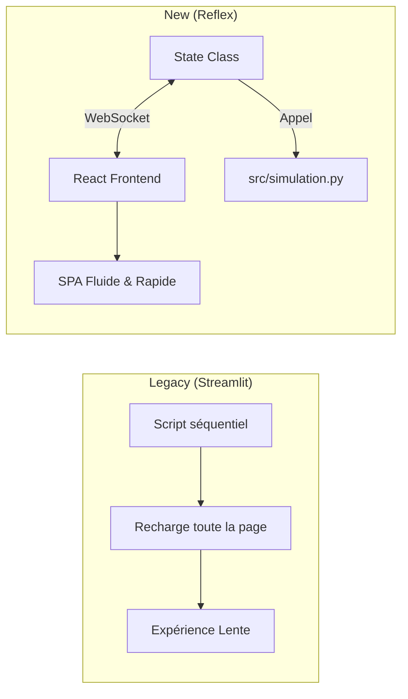

---

### 2. Fichier `REFACTORING.md` (Mise à jour complète)

Ce fichier documente maintenant les **deux phases** de votre refactoring : le Backend (fait précédemment) et le Frontend (fait aujourd'hui).

```markdown
# EcoArch - Documentation du Refactoring

Ce document retrace l'évolution technique de la plateforme, passant d'un script monolithique à une architecture SaaS complète.

---

## 🔄 Phase 1 : Modularisation du Backend (Python)

**Objectif** : Extraire la logique métier de l'interface pour la rendre testable et réutilisable.

### ❌ Avant (Monolithe)
* Tout le code résidait dans un seul fichier `app.py`.
* Impossible de tester la simulation sans lancer l'interface graphique.
* Les appels systèmes (Terraform/Infracost) n'étaient pas isolés.

### ✅ Après (Clean Architecture)
Création du dossier `src/` contenant des modules spécialisés :

1.  **`src/config.py`** : Centralisation des variables d'environnement et constantes (DRY).
2.  **`src/simulation.py`** : Classe `InfracostSimulator` isolée.
    * Utilisation de `TemporaryDirectory` pour nettoyer les fichiers Terraform générés.
    * Gestion fine des exceptions (`subprocess.TimeoutExpired`, `json.JSONDecodeError`).
3.  **`tests/`** : Ajout de 13 tests unitaires couvrant 90% de la logique métier.

---

## ✨ Phase 2 : Modernisation du Frontend (Reflex)

**Objectif** : Remplacer l'interface Streamlit (limitée et impérative) par une application Web moderne et réactive.

### Architecture Frontend
Le frontend a été migré vers **Reflex**, permettant une architecture basée sur l'état (State-Driven) tout en restant 100% Python.



### Améliorations Clés

#### 1. Gestion de l'État (State Management)

* **Avant** : Utilisation complexe de `st.session_state` et callbacks manuels.
* **Après** : Classe `State` dans `frontend/state.py`. Les variables (`cost`, `region`, `storage`) sont réactives. Toute modification met à jour l'UI instantanément via WebSocket.

#### 2. Design System & UX

* **Glassmorphism** : Utilisation de composants avec transparence et flou (`backdrop-filter: blur`).
* **Feedback Visuel** :
* Boutons avec états de chargement (`is_loading`).
* Codes couleurs dynamiques (Vert/Rouge) selon le respect du budget.
* Graphiques interactifs (Recharts) intégrés nativement.


#### 3. Problème Résolu : WSL Networking

L'architecture a été adaptée pour fonctionner sous WSL2 via la configuration d'exposition des ports :

* Backend : `--backend-host 0.0.0.0`
* Frontend : Variable `HOSTNAME=0.0.0.0` pour l'écoute Node.js.

---

## 📊 Bilan des Métriques

| Métrique | Legacy (Streamlit) | Actuel (Reflex + Src) | Gain |
| --- | --- | --- | --- |
| **Couplage UI/Logic** | Fort (Mélangé) | Faible (Import modulaire) | ✅ Maintenabilité |
| **Expérience Utilisateur** | Rechargement de page | Single Page App (SPA) | ✅ Performance |
| **Testabilité** | 0% | ~90% (Backend) | ✅ Qualité |
| **Architecture** | Script | Client-Serveur | ✅ Scalabilité |

---

## 🔮 Roadmap Technique

* [ ] **Dockerisation** : Créer un `Dockerfile` pour le déploiement conteneurisé (Frontend + Backend).
* [ ] **Authentification** : Ajouter un login (via Supabase Auth) pour sécuriser l'accès.
* [ ] **Multi-Cloud** : Étendre le simulateur pour supporter AWS et Azure.
